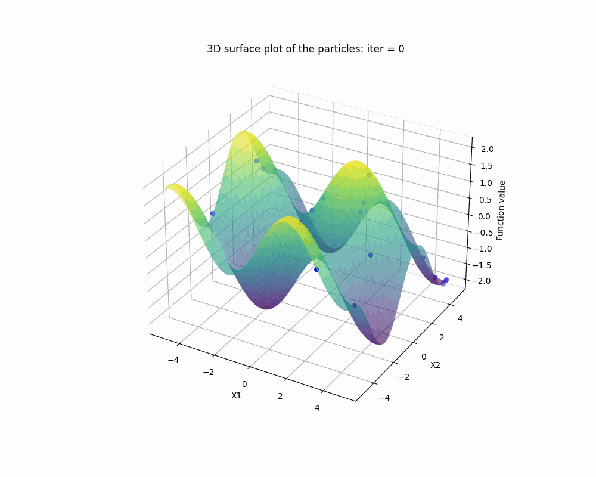

# Particle Swarm Optimisation
Here is an API which demonstrates the power of particle swarm optimisation when optimising multimodel functions.


# Quick Start
To run this API, first clone this repository to your local machine:
```
git clone https://github.com/cja119/ParticleSwarmOptimisation.git
```
Then install the necessary dependencies:
```
pip install -r dependencies.txt
```
Finally, run the API:
```
streamlit run particle_swarm_optimisation.py
```
# Theory
This optimisation algorithm uses the dynamic behaviour of a `particle swarm' optimise an objective function. The first step is to randomly initialise the location of a set of $n_p$ particles, $x_0$. The velocity of each particle is updated subject to the following parameters: an inertia term, I, a personal acceleration term, $a_p$, a global acceleration term, $a_g$, and a stochastic factor, $r$.

$$
v(t) = v(t-1) \cdot I + R a_p (X_p - X) + R a_g (X_g - X)
$$


$$
x(t) = x(t-1) + v(t)
$$


$$
X_p = \text{argmin}(f(X(\tilde{t})) \hspace{0.5cm} \forall \hspace{0.15cm} \tilde{t} \hspace{0.15cm} \in \hspace{0.15cm}  (0,t)
$$

$$
X_g = \text{argmin}(f(X_p)) \hspace{0.5cm} \forall \hspace{0.15cm} p \hspace{0.15cm} \in \hspace{0.15cm}  (0,n_p)
$$


