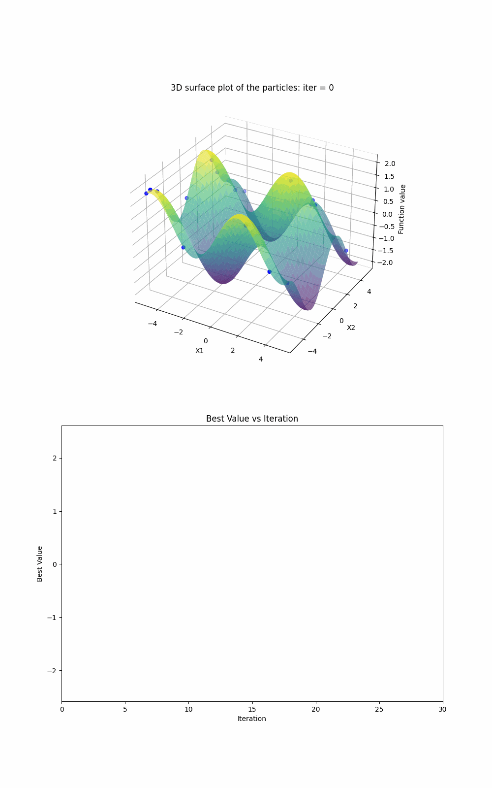

# Particle Swarm Optimisation
Here is an API which demonstrates the power of particle swarm optimisation when optimising multimodel functions.


# Quick Start
To run this API, first clone this repository to your local machine:
```
git clone https://github.com/cja119/ParticleSwarmOptimisation.git
```
Then install the necessary dependencies:
```
pip install -r dependencies.txt
```
Finally, run the API:
```
streamlit run particle_swarm_optimisation.py
```
# Theory
